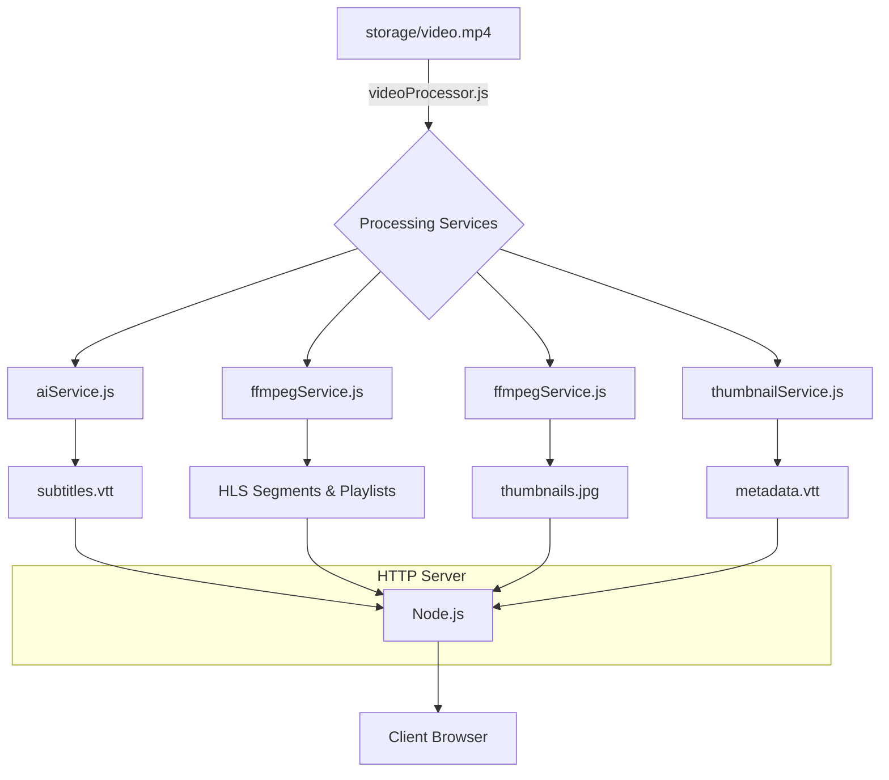

# Video Stream Server

A Node.js video streaming server that uses **HTTP Live Streaming (HLS)** to deliver video content. It includes a processing script to transcode video into multiple resolutions and generate subtitles using local AI.

> **[Read the full technical deep-dive on Medium](https://taophycc.medium.com/building-a-pro-tier-video-streaming-server-hls-ai-subtitles-and-interactive-thumbnails-af6f14ff40a4)** — Learn about the "Level 1 to Level 4" evolution of this project, from a naive static server to an AI-powered autonomous pipeline.


[](https://www.youtube.com/watch?v=k8P8tMzKKZk)

## Features

- **Adaptive Streaming:** Converts video to HLS (`.m3u8`) format for smooth playback.
- **Multi-Resolution:** Automatically transcodes video to 360p, 720p, and 1080p.
- **AI-Powered Subtitles:** Uses the **Whisper** model (via `@xenova/transformers`) to generate VTT subtitles locally.
- **Thumbnail Previews:** Generates a thumbnail sprite and VTT file for interactive timeline previews.
- **Custom Player:** Includes a simple frontend player with `hls.js` to test the stream, with quality switching and subtitle controls.



## Tech Stack

- **Backend:** Node.js, `fluent-ffmpeg`, `@xenova/transformers` for AI.
- **Frontend:** HTML5 Video, `hls.js`.
- **Video Processing:** FFmpeg.

## Prerequisites

**Important:** You must have **FFmpeg** installed on your system for video processing to work.

- **Node.js:** v18 or higher.
- **FFmpeg:**
  - **macOS:** `brew install ffmpeg`
  - **Linux:** `sudo apt install ffmpeg`
  - **Windows:** [Download FFmpeg](https://ffmpeg.org/download.html) and add it to your System PATH.

## Getting Started

### 1. Installation

Clone the repository and install the dependencies:

```bash
git clone https://github.com/Taophycc/Video-streaming-server.git
cd Video-streaming-server
pnpm install
```

### 2. Prepare Media

Place your raw video file in the `storage` directory. By default, the script looks for `storage/video.mp4`.

### 3. Process Video

Run the processing script. This will transcode the video, generate HLS segments, create AI subtitles, and produce thumbnail sprites.

*Note: This process may take time as it runs an AI model locally.*

```bash
node src/services/videoProcessor.js
```

### 4. Run the Server

Start the streaming server:

```bash
npm run dev
```

The server will start at `http://localhost:3000`.

## API Endpoints

- `GET /`: Serves the main video player dashboard (`public/index.html`).
- `GET /hls/master.m3u8`: The master HLS playlist.
- `GET /hls/{resolution}/playlist.m3u8`: Playlist for a specific resolution (e.g., `360p`, `720p`).
- `GET /hls/{resolution}/segment_{id}.ts`: Video segments for a specific resolution.
- `GET /hls/subtitles.vtt`: AI-generated subtitles.
- `GET /hls/thumbnails.jpg`: Thumbnail sprite image.
- `GET /hls/metadata.vtt`: Thumbnail metadata for timeline previews.

## Project Structure

```
.
├── public
│   ├── index.html        # Frontend player
│   └── demo.png
├── src
│   ├── config
│   │   └── cors.js       # CORS configuration
│   ├── controllers
│   │   ├── mediaController.js  # Serves HLS files
│   │   └── staticController.js # Serves the dashboard
│   ├── services
│   │   ├── aiService.js        # Whisper AI subtitle generation
│   │   ├── ffmpegService.js    # FFmpeg transcoding and thumbnail sprite generation
│   │   ├── thumbnailService.js # VTT metadata for thumbnails
│   │   └── videoProcessor.js   # Main processing pipeline
│   ├── router.js         # Main request router
│   └── server.js         # HTTP server setup
├── storage
│   ├── video.mp4         # Input source file (Git ignored)
│   └── hls               # Output: .m3u8, .ts, .vtt files
├── package.json
└── README.md
```

## Contributing

Contributions are welcome! Please feel free to submit a pull request.

1. Fork the Project
2. Create your Feature Branch (`git checkout -b feature/AmazingFeature`)
3. Commit your Changes (`git commit -m 'Add some AmazingFeature'`)
4. Push to the Branch (`git push origin feature/AmazingFeature`)
5. Open a Pull Request

## License

Distributed under the ISC License. See `LICENCE` for more information.
