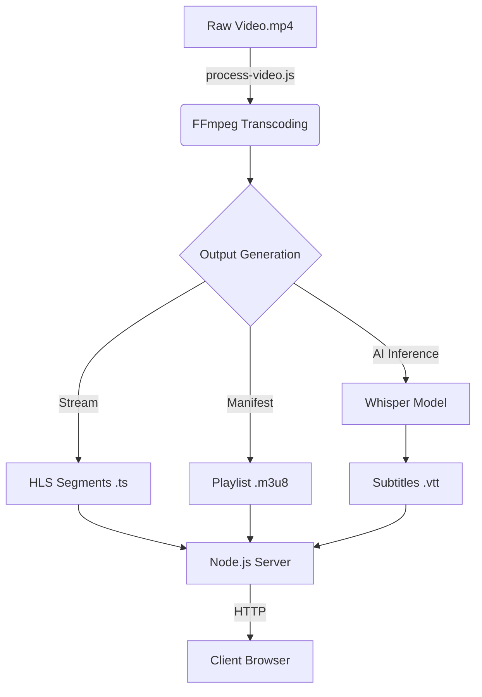

# Video Stream Server

A Node.js video streaming server that uses **HTTP Live Streaming (HLS)** to deliver video content. It includes a processing script to transcode video into multiple resolutions and generate subtitles using local AI.


> **[Read the full technical deep-dive on Medium](https://taophycc.medium.com/building-a-pro-tier-video-streaming-server-hls-ai-subtitles-and-interactive-thumbnails-af6f14ff40a4)** — Learn about the "Level 1 to Level 4" evolution of this project, from a naive static server to an AI-powered autonomous pipeline.


## Features

- **Adaptive Streaming:** Converts video to HLS (`.m3u8`) format for smooth playback.
- **Multi-Resolution:** Automatically transcodes video to 360p, 720p, and 1080p.
- **AI-Powered Subtitles:** Uses the **Whisper** model (via `@xenova/transformers`) to generate VTT subtitles locally.
- **Custom Player:** Includes a simple frontend player to test the stream.



## Prerequisites

**Important:** You must have **FFmpeg** installed on your system for video processing to work.

- **macOS:** `brew install ffmpeg`
- **Linux:** `sudo apt install ffmpeg`
- **Windows:** [Download FFmpeg](https://ffmpeg.org/download.html) and add it to your System PATH.

## Getting Started

### 1. Installation

Clone the repository and install the dependencies:

```bash
git clone https://github.com/Taophycc/Video-streaming-server.git
cd Video-streaming-server
npm install
```

### 2. Prepare Media

Place your raw video file in the storage directory. By default, the script looks for:
`storage/video.mp4`

### 3. Process Video (Transcode + AI)

Run the processing script. This will generate the HLS segments and the subtitle file.
*Note: This process may take time as it runs an AI model locally.*

```bash
node src/process-video.js
```

### 4. Generate thumbnails
Run the sprite generation script to create thumbnail previews for the player:
```bash
node generate-vtt.js
```

### 5. Run the Server

Start the streaming server:

```bash
npm run dev
```

The server will start at `http://localhost:3000`.

## Project Structure

```
.
├── src
│   ├── process-video.js  # Main pipeline: FFmpeg transcoding & Whisper AI inference
│   └── server.js         # Server for handling static HLS assets
├── storage
│   ├── video.mp4         # Input source file (Git ignored)
│   └── hls               # Output: .m3u8 playlists, .ts segments, .vtt subtitles
├── index.html            # Frontend player
├── generate-vtt.js       # Sprite sheet & coordinate mapping logic
├── package.json
└── README.md
```

## Dependencies

- **[@xenova/transformers](https://www.npmjs.com/package/@xenova/transformers):** For running AI models (Whisper) in Node.js.
- **[fluent-ffmpeg](https://www.npmjs.com/package/fluent-ffmpeg):** A fluent API for FFmpeg.
- **[onnxruntime-node](https://www.npmjs.com/package/onnxruntime-node):** ONNX Runtime for Node.js.
- **[sharp](https://www.npmjs.com/package/sharp):** High performance image processing.
- **[wavefile](https://www.npmjs.com/package/wavefile):** Library to read and write wave files.

## Scripts

- `npm run dev`: Starts the development server.